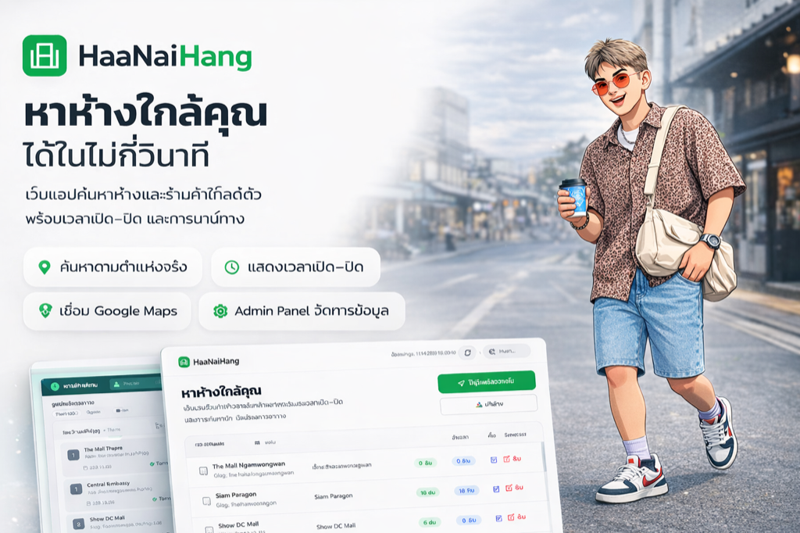

# Nattapart Worakun — Portfolio Website

A modern, high-performance portfolio website showcasing my journey from Chemistry Lab to Automation, Data & QA. Built with **Vanilla HTML/CSS/JS**, animated with **GSAP**, and styled with a luxury **pastel + dark** aesthetic with cinematic page entrances.



## 🚀 Live Demo
**Website**: [https://earthondev.github.io/Portfolio/](https://earthondev.github.io/Portfolio/)

## ✨ About Me
**Chemistry → Automation → Data & QA**

I am a chemist who evolved into a tech enthusiast. Starting from optimizing lab workflows with Excel VBA, I expanded my skills to **Python, SQL, R, Power BI, and Web Development**. I specialize in:

-   **Automation:** Reducing manual tasks by 60-80% using Python & Apps Script.
-   **Data Analysis:** Querying and modeling with **SQL**; statistical analysis & visualization with **R** (ggplot2, dplyr).
-   **Data Insights:** Creating actionable dashboards with Power BI.
-   **Web Development:** Building responsive, offline-first apps with Flutter & React.
-   **QA Mindset:** Applying lab-grade precision to software testing & validation.

## 🛠️ Tech Stack

-   **Frontend:** HTML5, Tailwind CSS (CDN), Vanilla JavaScript
-   **Animation:** GSAP 3.12, Lenis (smooth scroll), custom CSS keyframes
-   **Design:** Pastel curtain transitions, split-text hover effects, glassmorphism cards
-   **Performance:** Lazy loading, Service Worker (PWA), `font-kerning:none` for typography consistency
-   **Hosting:** GitHub Pages

## ✨ Page Entrance Animations

Each page features a unique cinematic entrance:

| Page | Curtain Color | Animation |
| :--- | :--- | :--- |
| **Home** | Beige `#e8e4dd` | `NATTAPART` scaleY squeeze → chars scatter in random directions |
| **Certificates** | Warm gray `#d4cfc7` | `CERTIFICATES` 3D rotateY flip from left → chars fly out in 360° |
| **Projects** | Sage green `#c8d5c3` | `PROJECTS` clip-path wipe from bottom → blur dissolve from center |
| **Contact** | Dark `#111827` | Overlay rises → text floats up with R→L char reveal → glides to final position |

## 📂 Featured Projects (9 Projects)
All projects are showcased with detailed case studies on the website.

| Project | Category | Tech Stack | Highlights |
| :--- | :--- | :--- | :--- |
| **Guessing Game Quest** | Web App | HTML5, CSS3, JS | Interactive image guessing game with score tracking. |
| **TonfernPDF v3.0** | Web App | HTML5, JS, pdf-lib | Professional PDF toolkit with persona-based UI (100% local). |
| **SentaiWatch DX** | watchOS App | Swift, SwiftUI | Hyper-realistic Megaranger Digitizer replica with audio engine. |
| **Laundry App** | Mobile App | Flutter, Google Sheets | Smart laundry shop management with real-time sync. |
| **Care for Mom** | Mobile App | Flutter, Gemini AI | AI-powered health companion for elderly care. |
| **HaaNaiHang** | Web App | React, Firebase | Mall & Store finder with proximity calculation. |
| **Slack Drive Bot** | Automation | Python, Slack API | Automated file organization saving 90% admin time. |
| **Inventory Amino** | Automation | AppSheet, No-Code | Mobile lab stock management with low-stock alerts. |
| **Expense Tracker** | Mobile App | Flutter, SQLite | Offline-first personal finance tracker. |


## 📁 Project Structure

```
Portfolio/
├── index.html                          # Home (NATTAPART entrance)
├── certificates.html                   # Certificates (CERTIFICATES entrance)
├── portfolio.html                      # Projects (PROJECTS entrance + cinema slider)
├── contact.html                        # Contact (CONTACT cinematic entrance)
├── inventory-analytics-dashboard.html  # Featured project page
├── case-studies/                       # Detailed case studies
│   ├── inventory-amino.html
│   └── inventory-analytics-dashboard.html
├── style.css                           # Design tokens & global styles
├── cache-bust.js                       # Cache busting helper
├── sw.js                               # Service Worker (PWA)
├── certificates.json                   # Certificates data
├── projects.json                       # Projects data
├── assets/
│   ├── projects/                       # Project screenshots & covers
│   ├── Profile/                        # Profile photos
│   ├── img/                            # General images
│   ├── certificates/                   # Certificate PDFs & images
│   ├── og/                             # Open Graph preview images
│   ├── js/
│   │   ├── animations.js               # GSAP/CSS animation helpers
│   │   ├── common.js                   # Shared nav/scroll helpers
│   │   └── inventory-analytics-dashboard.js
│   └── vendor/                         # Tailwind play CDN
└── .github/                            # GitHub Actions
```

## 🚀 Getting Started

1.  **Clone the repository**
    ```bash
    git clone https://github.com/Earthondev/Portfolio.git
    cd Portfolio
    ```

2.  **Run locally**
    You can use any static file server. For example, with Python:
    ```bash
    python3 -m http.server 8000
    ```

3.  **Open in browser**
    Go to `http://localhost:8000`

## 🎨 Design System

| Token | Value | Usage |
| :--- | :--- | :--- |
| **Primary** | `#00D9FF` (Neon Cyan) | Links, buttons, accents |
| **Secondary** | `#00FF94` (Neon Green) | Highlights, gradients |
| **Pastel Beige** | `#e8e4dd` | Curtain (Home), case study button |
| **Pastel Gray** | `#d4cfc7` | Curtain (Certificates) |
| **Pastel Sage** | `#c8d5c3` | Curtain (Projects) |
| **Background** | `#0a0a0f` | Page background |
| **Surface** | `#111827` | Cards, panels |
| **Heading Font** | Space Grotesk | Display & headings |
| **Body Font** | Sarabun | Body text (Thai support) |

## 📞 Contact

**Nattapart Worakun**
-   **Email**: [earthlikemwbb@gmail.com](mailto:earthlikemwbb@gmail.com)
-   **Website**: [earthondev.github.io/Portfolio](https://earthondev.github.io/Portfolio/)

---
© 2026 Nattapart Worakun. All rights reserved.
<!-- trigger-pages-deploy --> 2026-02-12T11:50:00
